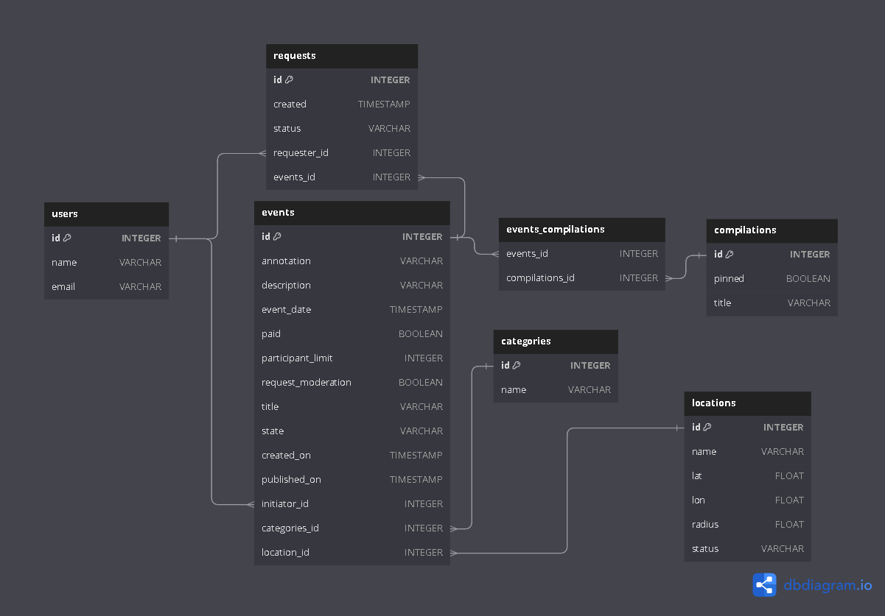

## ExploreWithMe
Приложение ExploreWithMe - афиша, которая позволяет пользователям делиться информацией об интересных событиях и находить компанию для участия в них.

### **_Инструкция по развертыванию проекта:_**
1. [x] скачать данный репозиторий
2. [x] mvn clean package
3. [x] mvn install
4. [x] docker-compose build
5. [x] docker-compose up -d
6. [x] основной сервис: http://localhost:8080
7. [x] сервис статистики: http://localhost:9090

### _Реализовано два сервиса:_
* основной сервис будет содержать всё необходимое для работы продукта;
* сервис статистики будет хранить количество просмотров и позволит делать различные выборки для анализа работы приложения.

#### API основного сервиса разделено на 3 части:
- публичная будет доступна без регистрации любому пользователю сети;
- закрытая будет доступна только авторизованным пользователям;
- административная — для администраторов сервиса.

1. Авторизованные пользователи могут добавлять в приложение новые мероприятия, редактировать их и просматривать после добавления;
могут подавать заявки на участие в интересующих мероприятиях;
создатель мероприятия может подтверждать заявки, которые отправили другие пользователи сервиса.
2. Администраторы могут добавлять, изменять и удалять категории для событий, могут закреплять на главной странице подборки мероприятий;
имеют возможность модерировать события, размещённых пользователями, — публикация или отклонение;
Также доступно управление пользователями — добавление, активация, просмотр и удаление.


### Реализация дополнительной функциональности: location
1. [x] Администрирование - возможность для администратора добавлять конкретные локации:города, театры, концертные залы и другие в виде координат (широта, долгота, радиус).
2. [x] Локация как добавляет ее администратор Location: name, lat, lon, rad.
3. [x] Получение списка этих локаций.
4. [x] Возможность поиска событий в конкретной локации.
5. [x] По геопозиции вычисляются ближайшие к событию локации, в радиус которых попадает события

### Добавленные контроллеры:
#### Admin:
``` POST /admin/locations  - создание локации администратором ```

``` UPDATE /admin/locations/{id} ```

``` DELETE /admin/locations/{id} - Удаление локации ```

``` UPDATE /confirm/{id} - для подтверждения или отмены локации ```

#### Public:
``` POST /locations  - создание локации пользователем ```

``` GET /locations – получение списка всех открытых локаций ```

``` GET /events/{locationId}/locations – получение списка событий по локации ```

``` GET /locations/{locationId} - Получение локации по Id ```

#### _Используемые технологии:_
* Java 11
* Spring Boot
* PostgreSQL
* Hibernate
* Maven
* Lombok
* Junit5
* Mockito
* Postman
* Docker


ссылка на диаграмму - https://dbdiagram.io/d/64f70baa02bd1c4a5efe21fb
